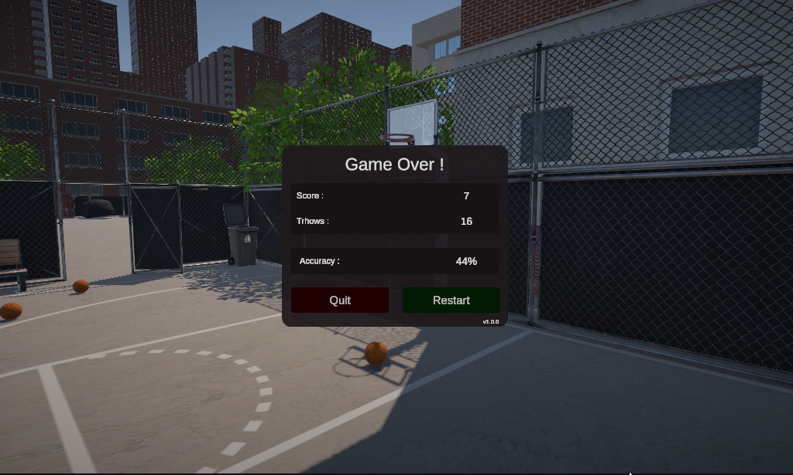

# Basketball arcade game
This project is a small physics-based basketball arcade game, made as a first experiment with Unity 3D. It was developed solo in under a week, with a focus on game feel, polish, and rapid iteration. While the code is open source, the full Unity project isn’t — it relies on a private submodule for assets (sounds, models, particles, etc.). The codebase remains accessible for learning or inspiration.

> 🖥️ **Windows only** – no installation required. Just unzip and play.  
> 🛠️ Built with Unity **6000.0.41f1** — keyboard/mouse only.  (468 Mo)

[**Download the latest build here**](https://github.com/cfrBernard/EX-BS-3D/releases)

## Features

- Fully physics-based throwing system (with spin, velocity and input influence)
- Arcade-style scoring system with accuracy breakdown
- UI menus with fade transitions, settings, and pause/help screens
- Start-to-finish game loop with end screen and restart options
- Audio/visual polish for game feedback

---

### v1.0.0

  

---

## ⚠️A Word of Warning
Due to time constraints and learning goals, the project uses a single-scene setup with a variety of purpose-specific scripts — some of which are... let’s say creative 😅. There’s no event system, no multi-scene management, and minimal abstraction. Consider it a snapshot of fast-paced prototyping rather than a clean architecture.

## 🛠️ Technologies Used

- **Unity (URP)**: Game engine
- **C#**: Primary language

---

## 📁 Asset Accessibility

Please note that **some assets used in this project are not included in the public repository** due to licensing constraints. Most of the assets used are sourced from Unity's Asset Store and are licensed under the **Extension Asset** terms

As such, you'll need to obtain these assets yourself if you wish to fully run or modify the project locally. They are located in the `Assets/Private` directory and are necessary for full functionality and visuals in the game.

> For more information, please refer to the [LICENSE](./LICENSE.md) file.
